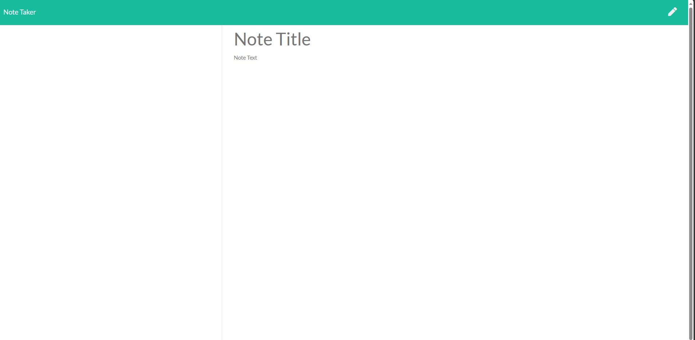

# Note Taking Application

An online note taking application where you can save and delete notes using Express.js

[](https://opensource.org/licenses/MIT)

---

## Contents

1. [About](#about)
2. [Story](#user-story)
3. [Visuals](#visuals)
4. [Installation](#installation)
5. [License](#license)
6. [Contributing](#contributing)
7. [Contact](#contact)

---

## About

This application is handy for any user wanting to keep or discard notes so the user may organize their thoughts, plans or ideas throughout the day. The source code was provided from https://github.com/coding-boot-camp/miniature-eureka and as a developer I needed to implement changes in order to use Express.js to save the user input and display them on the lefthand side of the screen.

---

### User Story

```
AS A small business owner
I WANT to be able to write and save notes
SO THAT I can organize my thoughts and keep track of tasks I need to complete
```

## Visuals:



---

## Installation:

```
To clone the repo:

git clone in gitbash
```

---

## License

License used for this project - MIT

- For more information on license types, please reference this website
  for additional licensing information - [https://choosealicense.com/](https://choosealicense.com/).

---

## Contributing:

To contribute to this application, create a pull request.
Here are the steps needed for doing that:

- Fork the repo
- Create a feature branch (git checkout -b NAME-HERE)
- Commit your new feature (git commit -m 'Add some feature')
- Push your branch (git push)
- Create a new Pull Request

Following a code review, your feature will be merged.

---

## Contact:

- GitHub Username: [conquerersHaki](https://github.com/conquerersHaki)
- GitHub Email: keighleychristina@yahoo.com
